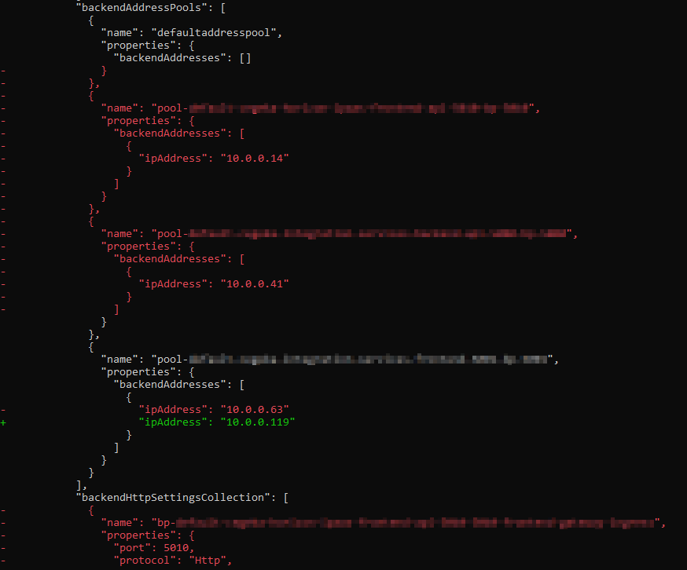

# Introduction 
AzCompare is a small tool to compare Azure subscriptions and resource groups.   
It exports the ARM Templates and compares the JSONs.

For now the comparer only works within the same tenant.

# Getting Started
Update `appsettings.json`.

- `AZURE_TENANT_ID`: The ID of the tenant, only required when you have multiple tenants for the same account
- `AzCompareOptions`
   - `Scope`: specifies the scope to compare, allowed values: `subscription` (default) or `resourcegroup`
   - `LeftId`: resource id of the subscription or resource group to compare
   - `LeftFilter`: string pattern to ignore, like an environment acronym
   - `RightId`: resource id of the subscription or resource group to compare to
   - `RightFilter`: string pattern to ignore, like an environment acronym

## Compare Subscriptions
```json
{
  "AZURE_TENANT_ID": "TENANT-ID",
  "AzCompareOptions": {
    "Scope": "subscription",
    "LeftId": "/subscriptions/SUBSCRIPTION-ID",
    "LeftFilter": "dev",
    "RightId": "/subscriptions/OTHER-SUBSCRIPTION-ID",
    "RightFilter": "tst"
  }
}
```

## Compare ResourceGroups
```json
{
  "AzCompareOptions": {
    "Scope": "resourcegroup",
    "LeftId": "/subscriptions/SUBSCRIPTION-ID/resourceGroups/RESOURCEGROUP-NAME",
    "LeftFilter": "acc",
    "RightId": "/subscriptions/SUBSCRIPTION-ID/resourceGroups/RESOURCEGROUP-NAME",
    "RightFilter": "prd"
  }
}
```

### Result
